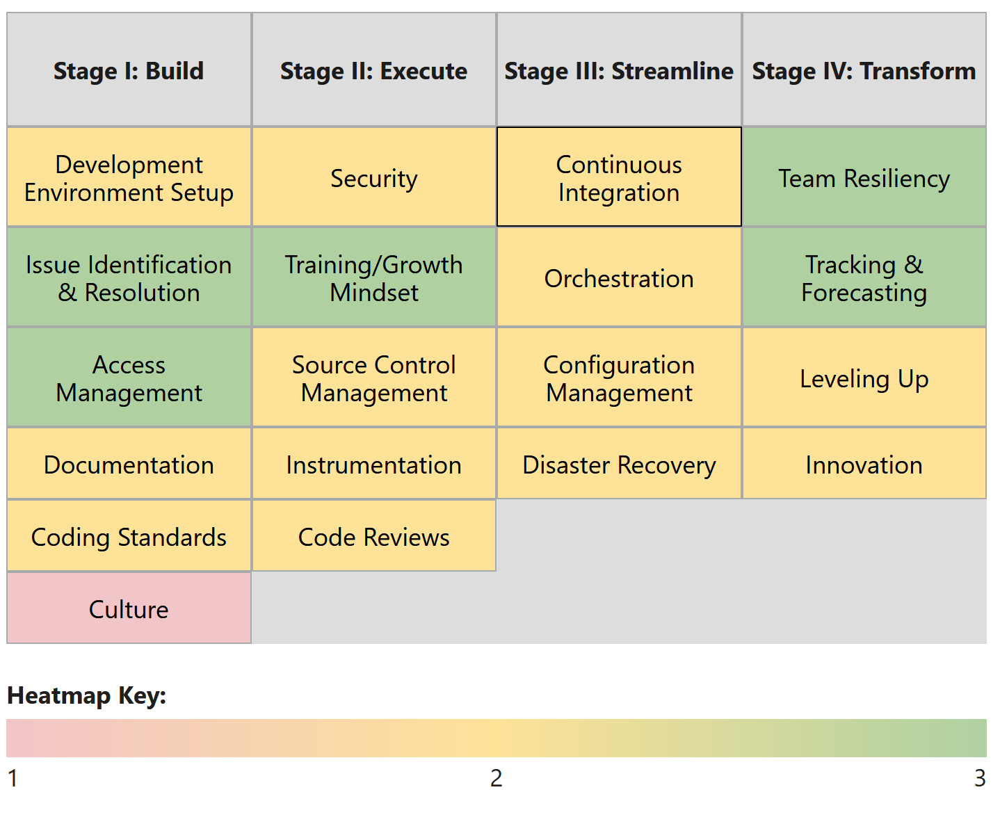
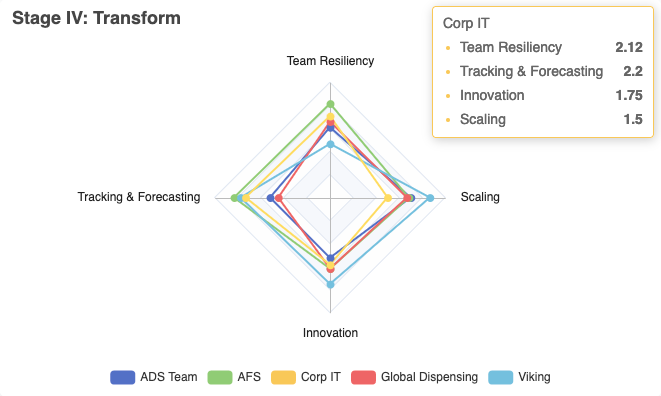

# Supercharge Your Django Dev Team: {.r-fit-text .original data-background-image="images/iStock-1377749663.jpg"}
## Introducing The Best™ Framework
#### Calvin Hendryx-Parker, CTO
#### Six Feet Up
#### DjangoCon US 2023

::: notes
- Nowadays, the world runs on software
- If you want to impact the world, you will want to be as productive as possible
:::

# Unearth The Source Of Inefficiency {.r-fit-text .original data-background-image="images/iStock-1358839342.jpg"}

- Accelerate delivery velocity
- Help management identify issues

::: notes
- How do you know if you could accelerate your delivery velocity?
- There could be a wide variety of issues at play
    - Examples include (mention 3-4): 
        - Delays in approval 
        - Inadequate communication
        - Insufficient testing 
        - Incomplete code 
        - Conflicts 
        - Security concerns 
        - Insufficient resources
        - Changes in priorities
        - Third-party tool dependency
        - Lack of goals 
        - Turnover
        - Ineffective monitoring 
        - Inefficient development 
        - Difficulty integrating software components 
- How do you help your management team see and care about those issues?
:::

# Gain A Strategic Advantage {.r-fit-text .original data-background-image="images/iStock-672950640.jpg"}

- 4 Stages — 19 Units — 90 Data Points
- Results in less than an hour
- Team reports, not individual results

::: notes
- Here comes BEST, a framework to help dev teams work more effectively
- It starts with a 4-part survey. Each developer is asked to answer 90 questions about their team’s processes, spanning 19 topics or units. 
- It takes less than an hour.
- Individual answers are not reported back to management; only team ratings are
:::

# Data-Driven Insights {.r-fit-text}

 

::: notes
- Team Report Heatmaps highlight areas that require attention
- You get practical recommendations on 90 datapoints
- For organizations with more than one dev teams, BEST will generate Performance Radar Maps that identify the top performing teams and empower your best developers to share their effective processes and knowledge.
- This gives you all great insights when talking to your bosses about improving things in your teams
:::

# Book a Demo {.original data-background-image="images/iStock-1377749663.jpg"}

